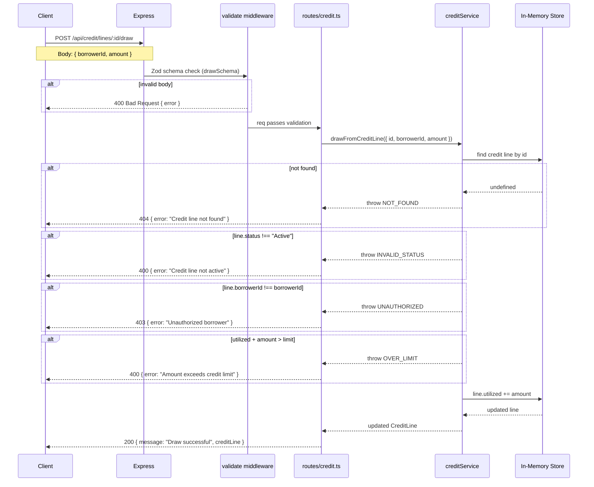

# Creditra Backend


API and services for the Creditra adaptive credit protocol: credit lines, risk evaluation, and (future) Horizon listener and interest accrual.

## About

This service provides:

- **API gateway** — REST endpoints for credit lines and risk evaluation
- **Health check** — `/health` for readiness
- **Planned:** Risk engine (wallet history, scoring), Horizon listener (events → DB), interest accrual, liquidity pool manager

Stack: **Node.js**, **Express**, **TypeScript**.

## Tech Stack

- **Express** — HTTP API
- **TypeScript** — ESM, strict mode
- **tsx** — dev run with watch
- **Jest + ts-jest** — unit & integration tests
- **ESLint + @typescript-eslint** — linting

## Setup

### Prerequisites

- Node.js 20+
- npm
- Docker 24+ and Docker Compose v2 (for the containerised workflow below)

### Install and run (host)

```bash
cd creditra-backend
npm install
```

**Development (watch):**

```bash
npm run dev
```

**Production:**

```bash
npm run build
npm start
```

API base: [http://localhost:3000](http://localhost:3000).

---

## Docker (local development)

The fastest way to get the full stack (API + PostgreSQL) running locally without installing Node or Postgres on your host machine.

### Quickstart

```bash
# 1. Copy the example env file and fill in your values
cp .env.example .env

# 2. Build the image and start all services (API + db)
docker compose up --build

# 3. (Separate terminal) Apply database migrations
docker compose exec api npm run db:migrate

# Stop everything and remove containers
docker compose down

# Stop and also delete the postgres volume (wipes DB data)
docker compose down -v
```

The API hot-reloads on every source-file save (via `tsx watch`) thanks to the bind-mount in `docker-compose.yml`.

### Ports

| Service  | Host port | Container port | Notes                                    |
|----------|-----------|----------------|------------------------------------------|
| API      | `3000`    | `3000`         | `http://localhost:3000` · Swagger at `/docs` |
| Postgres | `5432`    | `5432`         | Direct access via psql / TablePlus       |

### Environment files

| File            | Purpose                                                  |
|-----------------|----------------------------------------------------------|
| `.env.example`  | Committed template — lists every variable with safe defaults |
| `.env`          | Your local overrides — **gitignored, never committed**   |

`docker compose` reads `.env` automatically. The `DATABASE_URL` set inside `docker-compose.yml` overrides whatever is in `.env` so the API always reaches the `db` service by its compose hostname.

> **Security notes**
> - Containers run as the non-root `node` user (UID 1000).
> - `API_KEYS` and `WEBHOOK_SECRET` must be changed from the placeholder values before any real traffic is served.
> - The Postgres password in `docker-compose.yml` is intentionally simple for local dev; never reuse it in staging/production environments.
> - Stellar private keys and PII should never be stored in `.env` files checked into version control.

### Multi-stage image targets

| Target        | Used by             | Includes devDeps | Start command    |
|---------------|---------------------|------------------|------------------|
| `development` | `docker compose up` | ✅ Yes            | `npm run dev`    |
| `build`       | intermediate        | ✅ Yes            | `npm run build`  |
| `runner`      | production deploys  | ❌ No             | `node dist/index.js` |

Build the production image directly with:

```bash
docker build --target runner -t creditra-backend:latest .
```

---

### Environment

| Variable    | Required | Description                                              |
|-------------|----------|----------------------------------------------------------|
| `PORT`      | No       | Server port (default: `3000`)                            |
| `API_KEYS`  | **Yes**  | Comma-separated list of valid admin API keys (see below) |
| `CORS_ORIGINS` | Prod   | Comma-separated allowlist of exact browser origins        |
| `DATABASE_URL` | No    | PostgreSQL connection string (required for migrations)   |

Optional later: `REDIS_URL`, `HORIZON_URL`, etc.

### Browser origins

Browser clients are allowed only when their `Origin` header matches the
configured CORS policy.

- In production, set `CORS_ORIGINS` to a comma-separated list of exact
  origins, for example `https://app.example.com,https://admin.example.com`.
- In non-production environments, the server falls back to loopback origins
  such as `http://localhost:3000`, `http://127.0.0.1:3000`, and
  `http://[::1]:3000` so local UI development stays frictionless.
- Requests without an `Origin` header are still accepted; CORS only controls
  browser access, not API authentication.

> **Security note:** CORS is not an auth boundary. It does not protect
> `API_KEYS`, PII, or Stellar secrets. Keep those values server-side, use HTTPS
> in production, and keep the browser allowlist tight.

## Data model and migrations

The PostgreSQL schema is designed and documented in **[docs/data-model.md](docs/data-model.md)**. It covers borrowers, credit lines, risk evaluations, transactions, and events, with indexes and security notes.

- **Migrations** live in `migrations/` as sequential SQL files. See [migrations/README.md](migrations/README.md) for strategy and naming.
- **Apply migrations:** `DATABASE_URL=... npm run db:migrate`
- **Validate schema:** `DATABASE_URL=... npm run db:validate`

## Authentication

Admin and internal endpoints are protected by an **API key** sent in the
`X-API-Key` HTTP header.

### Configuring API keys

Set the `API_KEYS` environment variable to a comma-separated list of secret
keys before starting the service:

```bash
export API_KEYS="key-abc123,key-def456"
npm run dev
```

The service **will not start** (throws at boot) if `API_KEYS` is unset or
empty, preventing accidental exposure of unprotected admin routes.

### Making authenticated requests

```bash
curl -X POST http://localhost:3000/api/credit/lines/42/suspend \
  -H "X-API-Key: key-abc123"
```

| Result | Condition |
|--------|-----------|
| `401 Unauthorized` | `X-API-Key` header is absent |
| `403 Forbidden`    | Header present but key is not in `API_KEYS` |
| `200 OK`           | Key matches one of the configured valid keys |

> **Security note:** The value of an invalid key is **never** included in
> error responses or server logs. Always use HTTPS in production.

### Protected endpoints

| Method | Path | Description |
|--------|------|-------------|
| `POST` | `/api/credit/lines/:id/suspend` | Suspend an active credit line |
| `POST` | `/api/credit/lines/:id/close`   | Permanently close a credit line |
| `POST` | `/api/risk/admin/recalibrate`   | Trigger risk model recalibration |

Public endpoints (`GET /api/credit/lines`, `POST /api/risk/evaluate`, etc.)
do **not** require a key.

### Rotating API keys

Use a **rolling rotation** to avoid downtime:

1. Add the new key to `API_KEYS` (keep the old key alongside it).
2. Deploy / restart the service.
3. Update all clients and CI secrets to use the new key.
4. Remove the old key from `API_KEYS` and redeploy.

This ensures no requests are rejected during the transition window.

## CI / Quality Gates

The GitHub Actions workflow (`.github/workflows/ci.yml`) runs on every push and pull request:

| Step | Command | Fails build on… |
|------|---------|-----------------|
| TypeScript typecheck | `npm run typecheck` | Any type error |
| Lint | `npm run lint` | Any ESLint warning or error |
| Tests + Coverage | `npm test` | Failing test OR coverage < 95% |

### Run locally

```bash
# Typecheck
npm run typecheck

# Lint
npm run lint

# Lint with auto-fix
npm run lint:fix

# Tests (single run + coverage report)
npm test

# Tests in watch mode
npm run test:watch
```

**Coverage threshold:** 95% lines, branches, functions, and statements (enforced by Jest).

## API (current)

- `GET /health` — Service health
- `GET /api/credit/lines` — List credit lines (placeholder)
- `GET /api/credit/lines/:id` — Get credit line by id (placeholder)
- `POST /api/risk/evaluate` — Request risk evaluation; body: `{ "walletAddress": "..." }`; returns `400` with `{ "error": "Invalid wallet address format." }` for invalid Stellar addresses
### Public

- `GET  /health` — Service health
- `GET  /api/credit/lines` — List credit lines (placeholder)
- `GET  /api/credit/lines/:id` — Get credit line by id (placeholder)
- `POST /api/risk/evaluate` — Risk evaluation; body: `{ "walletAddress": "..." }`

### Admin (requires `X-API-Key`)

- `POST /api/credit/lines/:id/suspend` — Suspend a credit line
- `POST /api/credit/lines/:id/close` — Close a credit line
- `POST /api/risk/admin/recalibrate` — Trigger risk model recalibration

## Running tests

```bash
npm test            # run once with coverage report
npm run test:watch  # interactive watch mode
```

Target: ≥ 95 % coverage on all middleware and route files.

## Project layout

```
src/
  config/
    apiKeys.ts                              # loads + validates API_KEYS env var
  container/
    Container.ts                            # DI container; wires repos → services
  middleware/
    auth.ts                                 # requireApiKey (X-API-Key header)
    adminAuth.ts                            # admin-only authz helper
    validate.ts                             # Zod schema validation factory
    errorHandler.ts                         # global Express error handler
  models/                                   # shared TypeScript entity types
  repositories/
    interfaces/                             # repository contracts (TypeScript interfaces)
      CreditLineRepository.ts
      RiskEvaluationRepository.ts
      TransactionRepository.ts
    memory/                                 # in-memory implementations (dev / tests)
      InMemoryCreditLineRepository.ts
      InMemoryRiskEvaluationRepository.ts
      InMemoryTransactionRepository.ts
  routes/
    health.ts                               # GET /health
    credit.ts                               # credit-line endpoints (public + admin)
    risk.ts                                 # risk endpoints (public + admin)
  schemas/                                  # Zod request-body schemas
  services/
    creditService.ts                        # credit-line state machine + draw logic
    CreditLineService.ts                    # repo-backed credit line service
    riskService.ts                          # wallet risk evaluation
    RiskEvaluationService.ts               # repo-backed risk service
    horizonListener.ts                      # Stellar Horizon event poller
    jobQueue.ts                             # background job scheduler
  utils/
    response.ts                             # ok() / fail() envelope helpers
    stellarAddress.ts                       # Stellar public-key validation
  openapi.yaml                              # machine-readable API contract
  index.ts                                  # app bootstrap + server listen
docs/
  data-model.md                            # PostgreSQL schema documentation
  REPOSITORY_ARCHITECTURE.md              # deep-dive on the repository pattern
  security-checklist-backend.md
migrations/                                # sequential SQL migration files
.github/workflows/
  ci.yml                                   # CI: typecheck → lint → test → coverage
```

---

## Architecture

### Layer overview

The backend follows a strict layered architecture with dependency injection, ensuring each layer has a single responsibility and can be tested in isolation.

```
HTTP Client
    │
    ▼
┌─────────────────────────────────────────────┐
│              Express Middleware              │
│  cors · json · validate · requireApiKey     │
│              errorHandler                   │
└────────────────────┬────────────────────────┘
                     │
    ┌────────────────▼───────────────┐
    │           Routes               │
    │  /health  /api/credit  /api/risk│
    └────────────────┬───────────────┘
                     │  calls
    ┌────────────────▼───────────────┐
    │           Services             │
    │  creditService · riskService   │
    │  CreditLineService             │
    │  RiskEvaluationService         │
    └────────────────┬───────────────┘
                     │  calls
    ┌────────────────▼───────────────┐
    │         Repositories           │
    │  (interface contracts)         │
    │  InMemory* implementations     │
    │  → future: Postgres*           │
    └────────────────┬───────────────┘
                     │
    ┌────────────────▼───────────────┐
    │          Data Store            │
    │  In-memory Maps (dev/test)     │
    │  PostgreSQL (production)       │
    └────────────────────────────────┘

    ┌────────────────────────────────┐
    │  HorizonListener (background)  │
    │  polls Stellar Horizon API →   │
    │  dispatches HorizonEvent →     │
    │  jobQueue handlers → Services  │
    └────────────────────────────────┘
```

All repository and service instances are created once inside `Container.getInstance()` (singleton) and injected wherever needed. Swapping from in-memory to PostgreSQL requires only a change in `Container.ts`.

Full details: [docs/REPOSITORY_ARCHITECTURE.md](docs/REPOSITORY_ARCHITECTURE.md).

---

### Draw flow — sequence diagram

The draw operation is the core credit-line action. It validates the borrower's identity, checks credit limits, updates utilisation, and records a transaction.



---

### Stellar Horizon listener

`src/services/horizonListener.ts` runs a background polling loop that watches for on-chain events emitted by Soroban smart contracts:

```
setInterval(pollOnce, POLL_INTERVAL_MS)
    │
    └─► GET {HORIZON_URL}/events?contractId=...&startLedger=...
            │
            └─► dispatchEvent(HorizonEvent)
                    │
                    └─► registered EventHandlers (jobQueue, etc.)
```

**Key env vars** (see [Environment](#environment) table and [`.env.example`](.env.example)):

| Variable | Default | Purpose |
|---|---|---|
| `HORIZON_URL` | `https://horizon-testnet.stellar.org` | Stellar Horizon endpoint |
| `CONTRACT_IDS` | _(empty)_ | Comma-separated Soroban contract IDs to watch |
| `POLL_INTERVAL_MS` | `5000` | Polling frequency in ms |
| `HORIZON_START_LEDGER` | `latest` | Ledger to begin replaying from |

> **Soroban contract dependency (high level)**
> Creditra credit lines, draw authorisations, and repayments are ultimately settled against **Soroban smart contracts** deployed on the Stellar network. The backend treats these contracts as an external source of truth: the `HorizonListener` consumes contract events (`credit_line_created`, `draw_authorised`, etc.) and propagates them into the service layer. The actual contract addresses are configured via `CONTRACT_IDS` and are **not** hardcoded. No private keys or signing operations are performed by this service.

---

### OpenAPI specification

The full API contract is the machine-readable source of truth:

- **Bundled spec** (served at runtime): [`src/openapi.yaml`](src/openapi.yaml)
- **Swagger UI**: `http://localhost:3000/docs` (available when the server is running)
- **Raw docs copy**: [`docs/openapi.yaml`](docs/openapi.yaml)

Keep `openapi.yaml` in sync with route behaviour; the CI pipeline validates the spec on every push (`npm run validate:spec`).

---

## Security

Security is a priority for Creditra. Before deploying or contributing:

- Review the [Backend Security Checklist](docs/security-checklist-backend.md)
- Ensure all security requirements are met
- Run `npm audit` to check for vulnerabilities
- Maintain minimum 95% test coverage

## Merging to remote

```bash
git remote add origin <your-creditra-backend-repo-url>
git push -u origin main
```